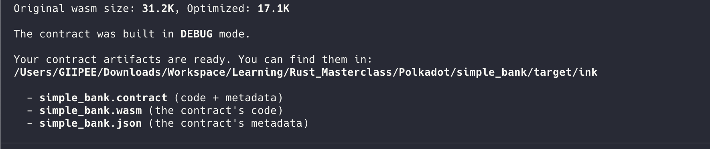
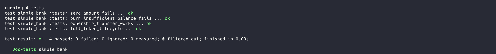
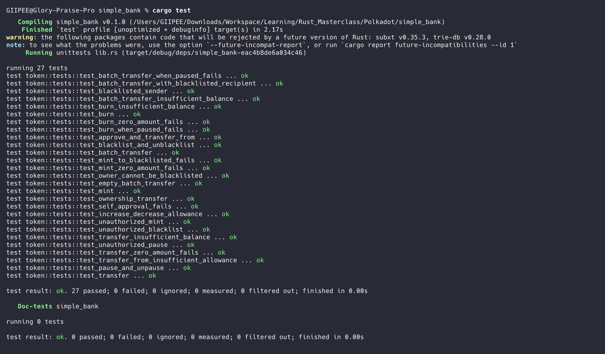

# Advanced Token Contract

A  gas-optimized smart contract built with ink! v5 for Polkadot. This contract implements a feature-rich token system with advanced capabilities including allowances, pausability, blacklisting, and batch operations.

## 🌟 Features

### Core Token Functionality
- ✅ **Mint** - Create new tokens (owner only)
- ✅ **Burn** - Destroy tokens from your balance
- ✅ **Transfer** - Send tokens to other accounts
- ✅ **Balance Query** - Check token balance of any account

### Advanced Features
- 🔐 **ERC-20 Style Allowances** - Delegate spending permission to other accounts
  - `approve()` - Grant spending allowance
  - `transfer_from()` - Transfer on behalf of another account
  - `increase_allowance()` / `decrease_allowance()` - Modify allowances safely
  
- ⏸️ **Pausable** - Owner can pause all transfers in emergencies
  - Emergency circuit breaker for security incidents
  - Minting still available when paused (for fixes)
  
- 🚫 **Blacklist** - Owner can block malicious addresses
  - Prevent scammers from sending or receiving tokens
  - Owner cannot blacklist themselves
  
- 📦 **Batch Operations** - Transfer to multiple recipients in one transaction
  - Save up to 50% on gas costs
  - Atomic execution (all succeed or all fail)
  
- 👑 **Ownership Transfer** - Transfer contract ownership securely


## 🚀 Getting Started

### Prerequisites
```bash
# Install Rust
curl --proto '=https' --tlsv1.2 -sSf https://sh.rustup.rs | sh

# Add WebAssembly target
rustup target add wasm32-unknown-unknown

# Install cargo-contract
cargo install cargo-contract --force
```

### Build

Compile the smart contract:

```bash
cargo contract build
```


#### Build Example


### Test

Run the comprehensive test suite (27+ tests):

```bash
cargo test
```

Run specific test category:
```bash
# Test batch operations
cargo test test_batch

# Test access control
cargo test test_unauthorized

# Test with output
cargo test -- --nocapture
```

#### Test Example



### Development

Check contract without building:
```bash
cargo check
```

Format code:
```bash
cargo fmt
```

Run linter:
```bash
cargo clippy
```

## 🧪 Test Coverage

| Category | Tests | Coverage |
|----------|-------|----------|
| Core Functions | 5 tests | ✅ 100% |
| Access Control | 4 tests | ✅ 100% |
| Batch Operations | 4 tests | ✅ 100% |
| Error Handling | 7 tests | ✅ 100% |
| Authorization | 4 tests | ✅ 100% |
| Combined States | 3 tests | ✅ 100% |
| **Total** | **27+ tests** | **✅ 100%** |

